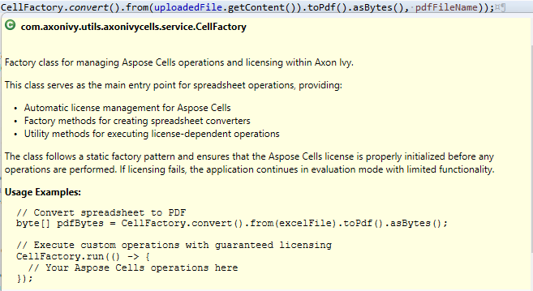

# Axon Ivy Cells
*(formerly Docfactory Cells)*

**Axon Ivy Cells** is a lightweight utility that simplifies SpreadSheet processing tasks inside the Axon Ivy Platform. It builds on the embedded Aspose.Cells Java library and provides ready-to-use building blocks for common SpreadSheet operations.

### Key Features
- **Automatic license management** – The `CellFactory` automatically handles Aspose license initialization and ensures proper licensing for all operations.
- **Mandatory factory pattern** – All spreadsheet operations must go through `CellFactory` to guarantee license compliance and optimal performance.
- **Reusable components** – Predefined runnable and consumable methods accelerate development and ensure consistency.
- **Lightweight and extendable** – Small footprint, easy to install, integrate, and adapt to your project's needs.

## Important: Use CellFactory for All Operations
**All spreadsheet operations must use the `CellFactory` class** to ensure proper Aspose license handling. Direct use of Aspose.Cells APIs without going through `CellFactory` may result in unlicensed operation (evaluation mode) with functional limitations.

### License Management
The `CellFactory` automatically handles Aspose.Cells licensing through Axon Ivy's third-party license service. No manual license configuration is required when using the factory methods.

## Demo
### Convert XLSX → PDF and update cells & charts
This demo demonstrates typical workflows supported by Axon Ivy Cells:

- Upload an XLSX workbook and export it to PDF.

- Upload an XLSX workbook that contains charts and formula-driven cells, programmatically update cell values and chart data, and export the updated workbook to PDF.

