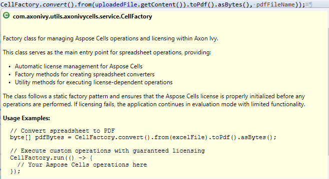

# Axon Ivy Cells
*(ehemals Docfactory)*

**Axon Ivy Cells** ist ein leichtgewichtiges Dienstprogramm, das die Bearbeitung von Tabellenkalkulationen innerhalb der Axon Ivy-Plattform vereinfacht. Es baut auf der integrierten Java-Bibliothek Aspose.Cells auf und bietet gebrauchsfertige Bausteine für gängige Tabellenkalkulationsvorgänge.

### Hauptmerkmale
- **Automatische Lizenzverwaltung** – Die `CellFactory` übernimmt automatisch die Initialisierung der Aspose-Lizenz und gewährleistet die ordnungsgemäße Lizenzierung für alle Vorgänge.
- **Obligatorisches Factory-Muster** – Alle Tabellenkalkulationsvorgänge müssen über die `CellFactory` laufen, um die Einhaltung der Lizenzbedingungen und eine optimale Leistung zu gewährleisten.
- **Wiederverwendbare Komponenten** – Vordefinierte ausführbare und verbrauchbare Methoden beschleunigen die Entwicklung und gewährleisten Konsistenz.
- **Leichtgewichtig und erweiterbar** – Geringer Speicherbedarf, einfache Installation, Integration und Anpassung an die Anforderungen Ihres Projekts.

## Wichtig: Verwenden Sie CellFactory für alle Vorgänge
**Alle Tabellenkalkulationsvorgänge müssen die Klasse `CellFactory` verwenden**, um eine ordnungsgemäße Handhabung der Aspose-Lizenz zu gewährleisten. Die direkte Verwendung der Aspose.Cells-APIs ohne Umweg über `CellFactory` kann zu einem nicht lizenzierten Betrieb (Evaluierungsmodus) mit funktionalen Einschränkungen führen.

### Lizenzverwaltung
Die `CellFactory` verwaltet die Lizenzen für Aspose.Cells automatisch über den Drittanbieter-Lizenzdienst von Axon Ivy. Bei Verwendung der Factory-Methoden ist keine manuelle Lizenzkonfiguration erforderlich.

