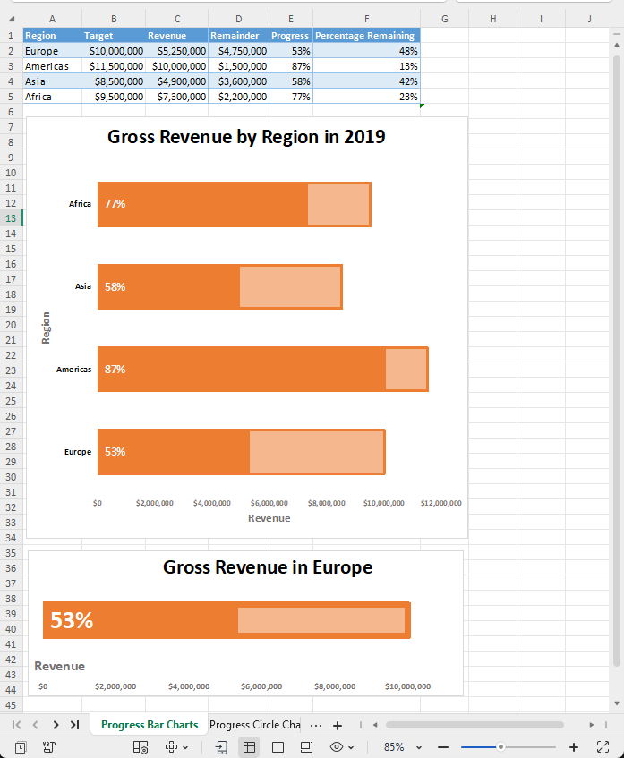

# Axon-Ivy-Zellen
*(ehemals Docfactory)*

**Axon Ivy Cells** ist ein leichtgewichtiges Dienstprogramm, das die Bearbeitung
von Tabellenkalkulationen innerhalb der Axon Ivy-Plattform vereinfacht. Es baut
auf der eingebetteten Aspose.Cells Java-Bibliothek auf und bietet
gebrauchsfertige Bausteine für gängige Tabellenkalkulationsoperationen.

### Wichtigste Funktionen
- **Automatische Lizenzverwaltung** – Die `CellFactory` übernimmt automatisch
  die Initialisierung der Aspose-Lizenz und stellt die ordnungsgemäße
  Lizenzierung für alle Vorgänge sicher.
- **Obligatorisches Factory-Muster** – Alle Tabellenkalkulationsvorgänge müssen
  über `CellFactory` erfolgen, um die Einhaltung der Lizenzbedingungen und eine
  optimale Leistung zu gewährleisten.
- **Wiederverwendbare Komponenten** – Vordefinierte ausführbare und nutzbare
  Methoden beschleunigen die Entwicklung und gewährleisten Konsistenz.
- **Leichtgewichtig und erweiterbar** – Geringer Speicherbedarf, einfach zu
  installieren, zu integrieren und an die Anforderungen Ihres Projekts
  anzupassen.

## Wichtig: Verwenden Sie CellFactory für alle Vorgänge.
**Alle Tabellenkalkulationsvorgänge müssen die Klasse „CellFactory“** verwenden,
um eine ordnungsgemäße Handhabung der Aspose-Lizenz zu gewährleisten. Die
direkte Verwendung von Aspose.Cells-APIs ohne Umweg über `CellFactory` kann zu
einem nicht lizenzierten Betrieb (Evaluierungsmodus) mit funktionalen
Einschränkungen führen.

### Lizenzverwaltung
Die Zellfabrik „ `“` verwaltet die Lizenzierung von Aspose.Cells automatisch
über den Drittanbieter-Lizenzdienst von Axon Ivy. Bei Verwendung der
Factory-Methoden ist keine manuelle Lizenzkonfiguration erforderlich.

## Demo
### Aktualisieren Sie formelgesteuerte Zellen und Diagramme und konvertieren Sie XLSX → PDF.
Diese Demo zeigt typische Arbeitsabläufe, die von Axon Ivy Cells unterstützt
werden: Aktualisieren Sie XLSX-Zellen und Diagramme und exportieren Sie sie
anschließend als PDF.

- Hochladen Sie eine normale XLSX-Datei mit Diagrammen und formelgesteuerten
  Zellen.

- Bearbeiten Sie die XLSX-Datei, indem Sie die Zellwerte ändern, auf die Formeln
  und Diagramme verweisen, aktualisieren Sie die Diagramme und exportieren Sie
  die aktualisierte XLSX-Datei als PDF.

