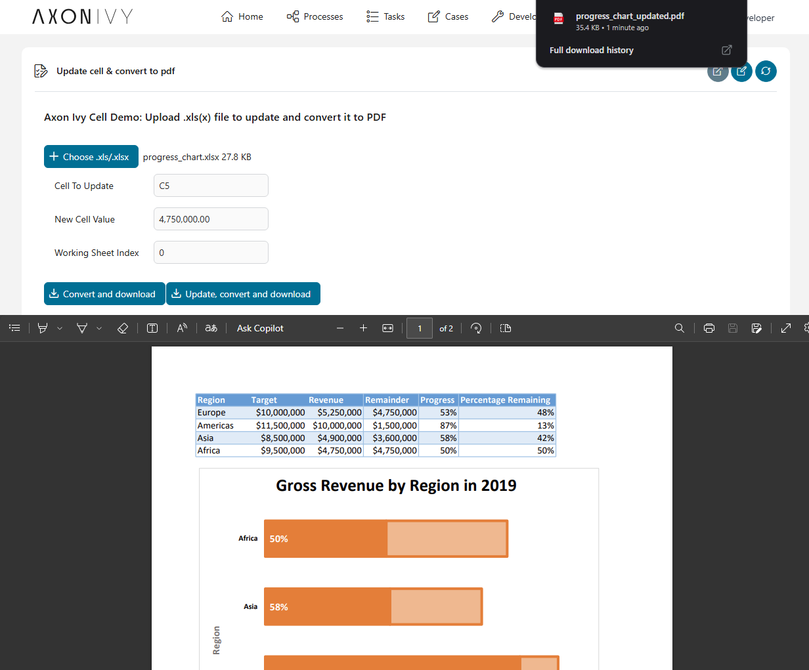

# #Axon Efeu Zellen
*(Einst Docfactory)*

**#Axon Efeu Zellen** sind ein leichtgewichtiger Nutzen jener vereinfacht
Tabelle verarbeitend Tasks innerhalb den #Axon Efeu Bahnsteig. Es baut weiter
das #eingraben Aspose.Zellen #Java Bibliothek und versieht bereit-zu-Nutzung
bauend Blöcke für allgemein Tabelle Operationen.

### Wesentliche Charakterzüge
- **Automatisches Schein Management** – Das `CellFactory` automatisch Henkel
  Aspose Schein #Initialisierung und sichert regelrechte Genehmigung für alle
  Operationen.
- **Obligatorisches Fabrik Muster** – Alle Tabelle Operationen müssen
  aufbrauchen `CellFactory` zu garantieren Schein Zustimmung und optimale
  Leistung.
- **#Wiederverwendbar Komponenten** – #Vordefiniert runnable und consumable
  Methoden beschleunigen Entwicklung und sichern Beschaffenheit.
- **Leichtgewichtig und extendable** – Kleiner #Fußstapfen, leicht zu
  installieren, integrier, und adaptieren zu eure ProjektsNotwendigkeiten.

## Wichtig: Benutz CellFactory für Alle Operationen
**Alle Tabelle Operationen müssen benutzen die `CellFactory` Klasse** zu sichern
regelrecht Aspose Schein Handing. Direkte Nutzung von Aspose.Zellen APIs ohne
#aufbrauchen `CellFactory` dürfen resultieren in #unbefugt Operation (Evaluation
Verfahren) mit funktional Begrenzungen.

### Schein Management
Das `CellFactory` automatisch Henkel Aspose.Zellen lizenzieren durch #Axon Efeus
#Dritter-Party Schein Bedienung. Kein manueller Schein Konfiguration ist bedürft
#wann die Fabrik Methoden benutzend.

## Demo
### Update Formel-#getrieben Zellen, Charts & umrechnen XLSX → #PDF
Diese Demo demonstriert typisch workflows unterstützt bei #Axon Efeu Zellen:
Verbesser XLSX Zellen und Charts, dann exportieren zu #PDF.

- #Hochladen ein normales XLSX Datei mit Charts und Formel-#getrieben Zellen.

- Bearbeite das XLSX Datei wechseln mal Zelle Werte jene sind #referenzieren bei
  Formeln und Charts, erfrischt die Charts, und exportieren das #auf dem
  Laufenden XLSX Datei zu #PDF.

